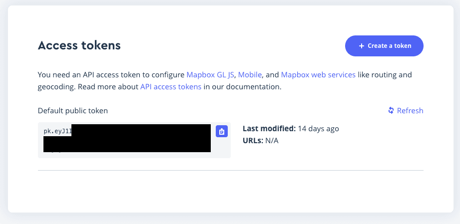
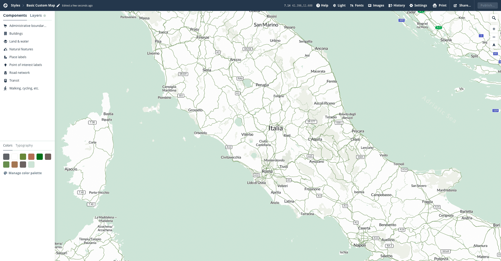
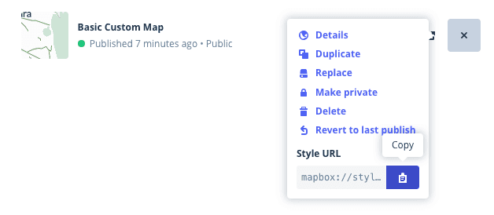

# 🗺 nomimapbox

A Nominatim + MapBox experiment

### Setup

Let's begin with [Nominatim](https://nominatim.openstreetmap.org/) that must be initialized with the data about the region you want to import. In our experiments we imported the entire Italy in ~15 hours with 2GB of RAM + 1GB of swap (this last one was crucial because the entire import process occupied more than 2GB of RAM) and a vCPU on a server hosted by [digitalocean.com](https://www.digitalocean.com/). Obviously **for larger regions you need a better hardware** and import process will last more.

First of all download the data for the region you want from [download.geofabrik.de](https://download.geofabrik.de/) or [download.openstreetmap.fr](http://download.openstreetmap.fr/extracts/).

```
mkdir nominatim
wget -O nominatim/data.osm.pbf http://download.openstreetmap.fr/extracts/europe/italy.osm.pbf
```

Then start importing your data using the [nominatim docker image](https://hub.docker.com/r/mediagis/nominatim):

```
docker run -t -v ./nominatimdata:/data mediagis/nominatim  sh /app/init.sh /data/data.osm.pbf postgresdata 4
```

This will require some hours, or even days, so let's continue by setting up your [Mapbox account](https://account.mapbox.com/). After you have signed up you should see a default access token in your homepage.



Replace `<your-access-token>` in the first line of `mapbox-test/js/main.js` with your access token.



Also you can create your own map styles at [studio.mapbox.com](https://studio.mapbox.com/) with an advanced editor that permits to change every aspect of it, going from the country labels to the roads width. In this experiment we created a custom style but if you want to use your style you can easily copy it's style ID:



And replace it in the `mapbox-test/js/main.js` file.

When the import process will be completed you can start the Nominatim server and Nginx with:
```
docker-compose up
```

If everything went well you can see your Mapbox map at http://localhost:8080.

Keep in mind that Nominatim is not a real search engine so you need to search places with theirs complete name. If you are searching for complex geocoder you should check these:
- [Photon](https://github.com/komoot/photon)
- [Pelias](https://github.com/pelias/pelias)